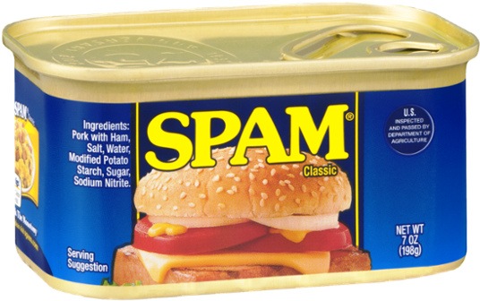

**spambox** is a web3 utility for attempting DOS attacks against Cartesi Rollups applications.
It is composed of a single Solidity smart contract that sends multiple empty inputs to an application.

## Setup

```sh
pnpm install
pnpm forge soldeer install
```
